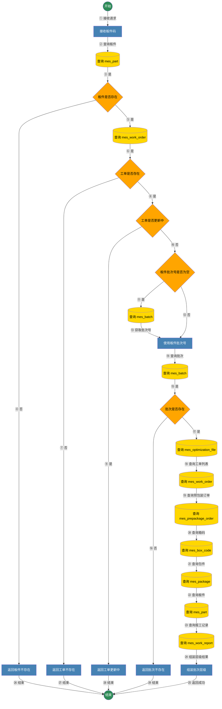
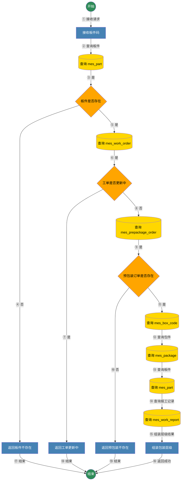
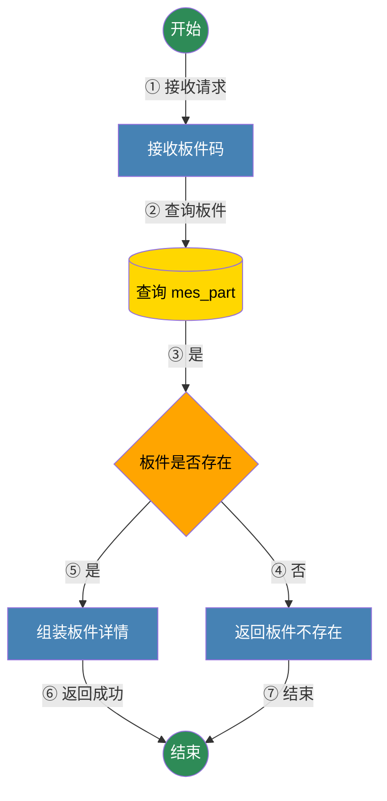
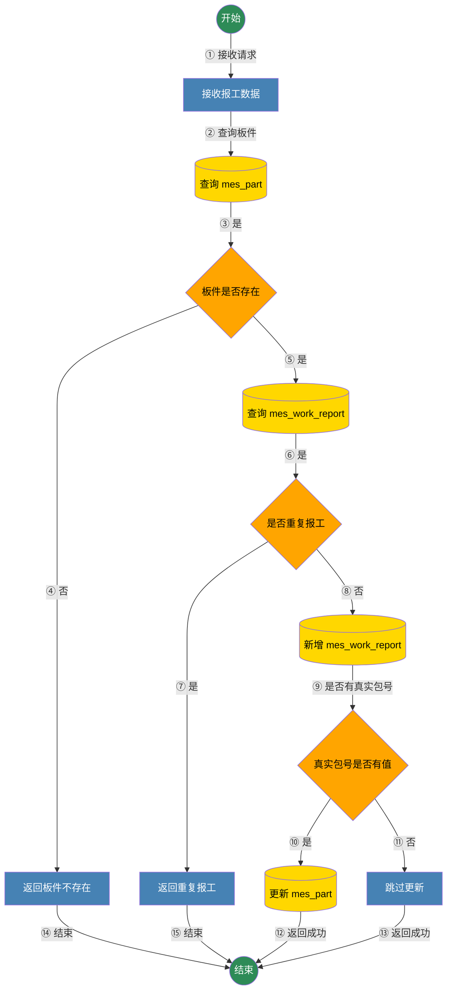

# 查询批次层级
## 接口描述
根据板件码查询对应批次及其完整层级结构，返回批次-优化文件-工单-预包装-箱码-包件-板件-报工的层级数据
## 前提条件
- 板件码已存在且未删除
- 板件关联工单与批次数据已入库
## 使用限制
- 无
## 实现方式简介
通过板件码定位板件与工单，校验工单更新状态后获取批次号，组装批次层级结构并返回
## 流程图
接口流程图

接口说明
1. 数据操作汇总
1. 数据库表
- mes_part 读取板件与层级板件数据
- mes_work_order 读取工单与工单列表
- mes_batch 读取批次信息
- mes_optimization_file 读取优化文件
- mes_prepackage_order 读取预包装订单
- mes_box_code 读取箱码
- mes_package 读取包件
- mes_work_report 读取板件报工记录
2. Redis Key
- 无
3. 外部接口
- 无
4. MQ Topic
- 无
## 请求
### 基本信息
| 项目 | 内容 |
| -- | ------------ |
| HTTP URL | /api/v1/production/part/{partCode}/work-order-and-batch |
| HTTP Method | GET |
| 性能上限 | 未设定 |
### 请求头
| 名称 | 类型 | 必填 | 描述 |
| -- | -- | -- | -------- |
| 无 | 无 | 无 | 无 |
### 路径参数
| 名称 | 类型 | 必填 | 描述 |
| -- | -- | -- | -------- |
| partCode | string | 是 | 板件码 |
### 查询参数
无
### 请求体
无
### 请求体示例
无
### cURL 请求示例
```bash
curl -X GET "/api/v1/production/part/PART-001/work-order-and-batch"
```
## 响应
### 响应体
| 字段名 | 类型 | 描述 |
| -- | -- | -------- |
| code | string | 业务码 |
| message | string | 业务消息 |
| data | BatchHierarchy | 批次层级数据 |
**BatchHierarchy子对象**
| 字段名 | 类型 | 描述 |
| -- | -- | -------- |
| batch | BatchDTO | 批次信息 |
| optimizingFiles | List<OptimizingFileDTO> | 优化文件列表 |
**BatchDTO子对象**
| 字段名 | 类型 | 描述 |
| -- | -- | -------- |
| id | long | 批次ID |
| batchNum | string | 批次号 |
| batchType | integer | 批次类型 |
| productTime | string | 生产时间 |
**OptimizingFileDTO子对象**
| 字段名 | 类型 | 描述 |
| -- | -- | -------- |
| id | long | 优化文件ID |
| batchId | long | 批次ID |
| optimizingFileName | string | 优化文件名 |
| stationCode | string | 工位编码 |
| urgency | integer | 紧急程度 |
| workOrders | List<WorkOrderDTO> | 工单列表 |
**WorkOrderDTO子对象**
| 字段名 | 类型 | 描述 |
| -- | -- | -------- |
| id | long | 工单ID |
| batchId | long | 批次ID |
| optimizingFileId | long | 优化文件ID |
| workId | string | 工单号 |
| route | string | 工艺路线 |
| orderType | string | 工单类型 |
| prepackageStatus | string | 预包装状态 |
| prepackageOrder | PrepackageOrderDTO | 预包装订单 |
**PrepackageOrderDTO子对象**
| 字段名 | 类型 | 描述 |
| -- | -- | -------- |
| id | long | 预包装订单ID |
| workOrderId | long | 工单ID |
| orderNum | string | 订单号 |
| consignor | string | 发货人 |
| receiver | string | 收货人 |
| installAddress | string | 安装地址 |
| boxes | List<BoxDTO> | 箱码列表 |
**BoxDTO子对象**
| 字段名 | 类型 | 描述 |
| -- | -- | -------- |
| id | long | 箱码ID |
| prepackageOrderId | long | 预包装订单ID |
| boxCode | string | 箱码 |
| building | string | 楼栋 |
| house | string | 单元 |
| room | string | 房间 |
| packages | List<PackageDTO> | 包件列表 |
**PackageDTO子对象**
| 字段名 | 类型 | 描述 |
| -- | -- | -------- |
| id | long | 包件ID |
| boxId | long | 箱码ID |
| packageNo | integer | 包号 |
| length | number | 长 |
| width | number | 宽 |
| depth | number | 高 |
| weight | number | 重量 |
| boxType | string | 箱型 |
| parts | List<PartDTO> | 板件列表 |
**PartDTO子对象**
| 字段名 | 类型 | 描述 |
| -- | -- | -------- |
| id | long | 板件ID |
| packageId | long | 包件ID |
| partCode | string | 板件码 |
| layer | integer | 层 |
| piece | integer | 片 |
| itemCode | string | 板件ID |
| matName | string | 花色 |
| itemLength | number | 长 |
| itemWidth | number | 宽 |
| itemDepth | number | 高 |
| xAxis | number | X轴 |
| yAxis | number | Y轴 |
| zAxis | number | Z轴 |
| sortOrder | integer | 分拣顺序 |
| standardList | string | 标准码原始JSON |
| realPackageNo | string | 真实打包包号 |
| workReports | List<WorkReportDTO> | 报工记录 |
**WorkReportDTO子对象**
| 字段名 | 类型 | 描述 |
| -- | -- | -------- |
| id | long | 报工ID |
| partCode | string | 板件码 |
| partStatus | string | 板件状态 |
| stationCode | string | 工位编码 |
| reportTime | string | 报工时间 |
### 响应体示例
```json
{
  "code": "0",
  "message": "OK",
  "data": {
    "batch": {
      "id": 1,
      "batchNum": "BATCH-001",
      "batchType": 1,
      "productTime": "2026-02-03T10:00:00"
    },
    "optimizingFiles": [
      {
        "id": 10,
        "batchId": 1,
        "optimizingFileName": "OPT-BATCH-001.txt",
        "stationCode": "C1A001",
        "urgency": 0,
        "workOrders": [
          {
            "id": 100,
            "batchId": 1,
            "optimizingFileId": 10,
            "workId": "WO-001",
            "route": "LINE-A",
            "orderType": "STANDARD",
            "prepackageStatus": "DONE",
            "prepackageOrder": {
              "id": 1000,
              "workOrderId": 100,
              "orderNum": "ORDER-001",
              "consignor": "发货人A",
              "receiver": "收货人B",
              "installAddress": "安装地址A",
              "boxes": [
                {
                  "id": 2000,
                  "prepackageOrderId": 1000,
                  "boxCode": "BOX-001",
                  "building": "1",
                  "house": "1",
                  "room": "101",
                  "packages": [
                    {
                      "id": 3000,
                      "boxId": 2000,
                      "packageNo": 1,
                      "length": 120.0,
                      "width": 60.0,
                      "depth": 10.0,
                      "weight": 8.5,
                      "boxType": "A",
                      "parts": [
                        {
                          "id": 4000,
                          "packageId": 3000,
                          "partCode": "PART-001",
                          "layer": 1,
                          "piece": 1,
                          "itemCode": "ITEM-001",
                          "matName": "WHITE",
                          "itemLength": 100.0,
                          "itemWidth": 50.0,
                          "itemDepth": 5.0,
                          "xAxis": 10.0,
                          "yAxis": 20.0,
                          "zAxis": 0.0,
                          "sortOrder": 1,
                          "standardList": "[\"STD-A\"]",
                          "realPackageNo": "PKG-REAL-001",
                          "workReports": [
                            {
                              "id": 5000,
                              "partCode": "PART-001",
                              "partStatus": "DONE",
                              "stationCode": "C1A001",
                              "reportTime": "2026-02-03T10:10:00"
                            }
                          ]
                        }
                      ]
                    }
                  ]
                }
              ]
            }
          }
        ]
      }
    ]
  }
}
```
### 错误码
| HTTP状态码 | 错误码 | 描述 | 排查建议 |
| -------- | ------ | ------ | ---- |
| 400 | VALIDATION_ERROR | 参数校验失败 | 检查请求参数 |
| 404 | 404 | 板件或批次或预包装不存在 | 检查partCode及数据是否入库 |
| 409 | 409 | 工单更新中 | 稍后重试 |
| 500 | 500 | 系统异常 | 查看服务日志 |
# 查询包装层级
## 接口描述
根据板件码查询对应预包装订单及其完整层级结构
## 前提条件
- 板件码已存在且未删除
- 板件已关联预包装订单数据
## 使用限制
- 无
## 实现方式简介
通过板件码定位板件与工单，校验工单更新状态后查询预包装订单层级结构并返回
## 流程图
接口流程图

接口说明
1. 数据操作汇总
1. 数据库表
- mes_part 读取板件与层级板件数据
- mes_work_order 读取工单状态
- mes_prepackage_order 读取预包装订单
- mes_box_code 读取箱码
- mes_package 读取包件
- mes_work_report 读取板件报工记录
2. Redis Key
- 无
3. 外部接口
- 无
4. MQ Topic
- 无
## 请求
### 基本信息
| 项目 | 内容 |
| -- | ------------ |
| HTTP URL | /api/v1/production/part/{partCode}/package |
| HTTP Method | GET |
| 性能上限 | 未设定 |
### 请求头
| 名称 | 类型 | 必填 | 描述 |
| -- | -- | -- | -------- |
| 无 | 无 | 无 | 无 |
### 路径参数
| 名称 | 类型 | 必填 | 描述 |
| -- | -- | -- | -------- |
| partCode | string | 是 | 板件码 |
### 查询参数
无
### 请求体
无
### 请求体示例
无
### cURL 请求示例
```bash
curl -X GET "/api/v1/production/part/PART-001/package"
```
## 响应
### 响应体
| 字段名 | 类型 | 描述 |
| -- | -- | -------- |
| code | string | 业务码 |
| message | string | 业务消息 |
| data | PrepackageHierarchy | 预包装层级数据 |
**PrepackageHierarchy子对象**
| 字段名 | 类型 | 描述 |
| -- | -- | -------- |
| prepackageOrder | PrepackageOrderDTO | 预包装订单 |
**PrepackageOrderDTO子对象**
| 字段名 | 类型 | 描述 |
| -- | -- | -------- |
| id | long | 预包装订单ID |
| workOrderId | long | 工单ID |
| orderNum | string | 订单号 |
| consignor | string | 发货人 |
| receiver | string | 收货人 |
| installAddress | string | 安装地址 |
| boxes | List<BoxDTO> | 箱码列表 |
**BoxDTO子对象**
| 字段名 | 类型 | 描述 |
| -- | -- | -------- |
| id | long | 箱码ID |
| prepackageOrderId | long | 预包装订单ID |
| boxCode | string | 箱码 |
| building | string | 楼栋 |
| house | string | 单元 |
| room | string | 房间 |
| packages | List<PackageDTO> | 包件列表 |
**PackageDTO子对象**
| 字段名 | 类型 | 描述 |
| -- | -- | -------- |
| id | long | 包件ID |
| boxId | long | 箱码ID |
| packageNo | integer | 包号 |
| length | number | 长 |
| width | number | 宽 |
| depth | number | 高 |
| weight | number | 重量 |
| boxType | string | 箱型 |
| parts | List<PartDTO> | 板件列表 |
**PartDTO子对象**
| 字段名 | 类型 | 描述 |
| -- | -- | -------- |
| id | long | 板件ID |
| packageId | long | 包件ID |
| partCode | string | 板件码 |
| layer | integer | 层 |
| piece | integer | 片 |
| itemCode | string | 板件ID |
| matName | string | 花色 |
| itemLength | number | 长 |
| itemWidth | number | 宽 |
| itemDepth | number | 高 |
| xAxis | number | X轴 |
| yAxis | number | Y轴 |
| zAxis | number | Z轴 |
| sortOrder | integer | 分拣顺序 |
| standardList | string | 标准码原始JSON |
| realPackageNo | string | 真实打包包号 |
| workReports | List<WorkReportDTO> | 报工记录 |
**WorkReportDTO子对象**
| 字段名 | 类型 | 描述 |
| -- | -- | -------- |
| id | long | 报工ID |
| partCode | string | 板件码 |
| partStatus | string | 板件状态 |
| stationCode | string | 工位编码 |
| reportTime | string | 报工时间 |
### 响应体示例
```json
{
  "code": "0",
  "message": "OK",
  "data": {
    "prepackageOrder": {
      "id": 1000,
      "workOrderId": 100,
      "orderNum": "ORDER-001",
      "consignor": "发货人A",
      "receiver": "收货人B",
      "installAddress": "安装地址A",
      "boxes": [
        {
          "id": 2000,
          "prepackageOrderId": 1000,
          "boxCode": "BOX-001",
          "building": "1",
          "house": "1",
          "room": "101",
          "packages": [
            {
              "id": 3000,
              "boxId": 2000,
              "packageNo": 1,
              "length": 120.0,
              "width": 60.0,
              "depth": 10.0,
              "weight": 8.5,
              "boxType": "A",
              "parts": [
                {
                  "id": 4000,
                  "packageId": 3000,
                  "partCode": "PART-001",
                  "layer": 1,
                  "piece": 1,
                  "itemCode": "ITEM-001",
                  "matName": "WHITE",
                  "itemLength": 100.0,
                  "itemWidth": 50.0,
                  "itemDepth": 5.0,
                  "xAxis": 10.0,
                  "yAxis": 20.0,
                  "zAxis": 0.0,
                  "sortOrder": 1,
                  "standardList": "[\"STD-A\"]",
                  "realPackageNo": "PKG-REAL-001",
                  "workReports": [
                    {
                      "id": 5000,
                      "partCode": "PART-001",
                      "partStatus": "DONE",
                      "stationCode": "C1A001",
                      "reportTime": "2026-02-03T10:10:00"
                    }
                  ]
                }
              ]
            }
          ]
        }
      ]
    }
  }
}
```
### 错误码
| HTTP状态码 | 错误码 | 描述 | 排查建议 |
| -------- | ------ | ------ | ---- |
| 400 | VALIDATION_ERROR | 参数校验失败 | 检查请求参数 |
| 404 | 404 | 板件或预包装不存在 | 检查partCode及数据是否入库 |
| 409 | 409 | 工单更新中 | 稍后重试 |
| 500 | 500 | 系统异常 | 查看服务日志 |
# 查询板件详细信息
## 接口描述
根据板件码查询板件自身的全部详细信息
## 前提条件
- 板件码已存在且未删除
## 使用限制
- 无
## 实现方式简介
通过板件码查询板件记录并返回全量字段信息
## 流程图
接口流程图

接口说明
1. 数据操作汇总
1. 数据库表
- mes_part 读取板件详情
2. Redis Key
- 无
3. 外部接口
- 无
4. MQ Topic
- 无
## 请求
### 基本信息
| 项目 | 内容 |
| -- | ------------ |
| HTTP URL | /api/v1/production/part/{partCode}/detail |
| HTTP Method | GET |
| 性能上限 | 未设定 |
### 请求头
| 名称 | 类型 | 必填 | 描述 |
| -- | -- | -- | -------- |
| 无 | 无 | 无 | 无 |
### 路径参数
| 名称 | 类型 | 必填 | 描述 |
| -- | -- | -- | -------- |
| partCode | string | 是 | 板件码 |
### 查询参数
无
### 请求体
无
### 请求体示例
无
### cURL 请求示例
```bash
curl -X GET "/api/v1/production/part/PART-001/detail"
```
## 响应
### 响应体
| 字段名 | 类型 | 描述 |
| -- | -- | -------- |
| id | long | 板件ID |
| partCode | string | 板件码 |
| batchNum | string | 批次号 |
| workId | string | 工单号 |
| boxId | long | 箱码ID |
| packageId | long | 包件ID |
| layer | integer | 第几层 |
| piece | integer | 第几片 |
| itemCode | string | 板件ID业务标识 |
| itemName | string | 板件描述 |
| matName | string | 花色 |
| itemLength | number | 板件长 |
| itemWidth | number | 板件宽 |
| itemDepth | number | 板件高 |
| xAxis | number | X轴坐标 |
| yAxis | number | Y轴坐标 |
| zAxis | number | Z轴坐标 |
| sortOrder | integer | 分拣顺序 |
| standardList | List<Map> | 标准码列表 |
| standardListRaw | string | 标准码原始JSON |
| realPackageNo | string | 真实打包包号 |
| latestPartStatus | string | 最新报工状态 |
| package | PackageSummary | 包件信息 |
| box | BoxSummary | 箱子信息 |
| prepackageOrder | PrepackageOrderSummary | 预包装订单信息 |
| workOrder | WorkOrderSummary | 工单信息 |
| optimizingFile | OptimizingFileSummary | 优化文件信息 |
| batch | BatchSummary | 批次信息 |
| isDeleted | integer | 逻辑删除标识 |
| createdTime | string | 创建时间 |
| updatedTime | string | 更新时间 |
| description | string | 兼容字段板件描述 |
| color | string | 兼容字段花色 |
### 响应体示例
```json
{
  "id": 4000,
  "partCode": "PART-001",
  "batchNum": "BATCH-001",
  "workId": "WO-001",
  "boxId": 2000,
  "packageId": 3000,
  "layer": 1,
  "piece": 1,
  "itemCode": "ITEM-001",
  "itemName": "侧板",
  "matName": "WHITE",
  "itemLength": 100.0,
  "itemWidth": 50.0,
  "itemDepth": 5.0,
  "xAxis": 10.0,
  "yAxis": 20.0,
  "zAxis": 0.0,
  "sortOrder": 1,
  "standardList": [
    {
      "STD-A": 1
    }
  ],
  "standardListRaw": "[\"STD-A\"]",
  "realPackageNo": "PKG-REAL-001",
  "latestPartStatus": "DONE",
  "package": {
    "id": 3000,
    "boxId": 2000,
    "packageNo": 1,
    "length": 120.0,
    "width": 60.0,
    "depth": 10.0,
    "weight": 8.5,
    "boxType": "A"
  },
  "box": {
    "id": 2000,
    "prepackageOrderId": 1000,
    "boxCode": "BOX-001",
    "building": "1",
    "house": "1",
    "room": "101"
  },
  "prepackageOrder": {
    "id": 1000,
    "workOrderId": 100,
    "orderNum": "ORDER-001",
    "consignor": "发货人A",
    "receiver": "收货人B",
    "installAddress": "安装地址A"
  },
  "workOrder": {
    "id": 100,
    "batchId": 1,
    "optimizingFileId": 10,
    "workId": "WO-001",
    "route": "LINE-A",
    "orderType": "STANDARD",
    "prepackageStatus": "DONE"
  },
  "optimizingFile": {
    "id": 10,
    "batchId": 1,
    "optimizingFileName": "OPT-BATCH-001.txt",
    "stationCode": "C1A001",
    "urgency": 0
  },
  "batch": {
    "id": 1,
    "batchNum": "BATCH-001",
    "batchType": 1,
    "productTime": "2026-02-03T10:00:00"
  },
  "isDeleted": 0,
  "createdTime": "2026-02-03T10:00:00",
  "updatedTime": "2026-02-03T10:10:00",
  "description": "侧板",
  "color": "WHITE"
}
```
### 错误码
| HTTP状态码 | 错误码 | 描述 | 排查建议 |
| -------- | ------ | ------ | ---- |
| 400 | VALIDATION_ERROR | 参数校验失败 | 检查请求参数 |
| 404 | NOT_FOUND | 板件不存在 | 检查partCode是否正确 |
| 500 | INTERNAL_SERVER_ERROR | 系统异常 | 查看服务日志 |
# 提交板件报工
## 接口描述
提交板件报工记录，支持幂等性校验与真实打包包号入库
## 前提条件
- 板件码已存在
- 报工状态与工位信息完整
## 使用限制
- 无
## 实现方式简介
校验板件存在并做重复报工检查，保存报工记录并在需要时更新板件真实打包包号
## 流程图
接口流程图

接口说明
1. 数据操作汇总
1. 数据库表
- mes_part 读取板件并更新真实打包包号
- mes_work_report 读取最新报工并插入报工记录
2. Redis Key
- 无
3. 外部接口
- 无
4. MQ Topic
- 无
## 请求
### 基本信息
| 项目 | 内容 |
| -- | ------------ |
| HTTP URL | /api/v1/production/work-report |
| HTTP Method | POST |
| 性能上限 | 未设定 |
### 请求头
| 名称 | 类型 | 必填 | 描述 |
| -- | -- | -- | -------- |
| Content-Type | string | 是 | application/json |
### 路径参数
无
### 查询参数
无
### 请求体
| 名称 | 类型 | 必填 | 说明 |
| -- | -- | -- | -------- |
| partCode | string | 是 | 板件码 |
| partStatus | string | 是 | 板件状态 |
| stationCode | string | 是 | 工位编码 |
| stationName | string | 否 | 工位名称 |
| operatorId | string | 否 | 操作工ID |
| operatorName | string | 否 | 操作工姓名 |
| realPackageNo | string | 否 | 真实打包包号 |
### 请求体示例
**场景1：含真实打包包号报工**（partCode、partStatus、stationCode必传）
```json
{
  "partCode": "PART-001",
  "partStatus": "DONE",
  "stationCode": "C1A001",
  "stationName": "开料",
  "operatorId": "OP-1",
  "operatorName": "测试员",
  "realPackageNo": "PKG-REAL-001"
}
```
**场景2：不传真实打包包号**
```json
{
  "partCode": "PART-001",
  "partStatus": "CHECKED",
  "stationCode": "C1A001",
  "stationName": "开料"
}
```
### cURL 请求示例
> 以场景1为例
```bash
curl -X POST "/api/v1/production/work-report" -H "Content-Type: application/json" -d "{\"partCode\":\"PART-001\",\"partStatus\":\"DONE\",\"stationCode\":\"C1A001\",\"stationName\":\"开料\",\"operatorId\":\"OP-1\",\"operatorName\":\"测试员\",\"realPackageNo\":\"PKG-REAL-001\"}"
```
> 以场景2为例
```bash
curl -X POST "/api/v1/production/work-report" -H "Content-Type: application/json" -d "{\"partCode\":\"PART-001\",\"partStatus\":\"CHECKED\",\"stationCode\":\"C1A001\",\"stationName\":\"开料\"}"
```
## 响应
### 响应体
| 字段名 | 类型 | 描述 |
| -- | -- | -------- |
| success | boolean | 是否成功 |
| message | string | 结果信息 |
| partCode | string | 板件码 |
| timestamp | long | 返回时间戳 |
### 响应体示例
```json
{
  "success": true,
  "message": "报工成功",
  "partCode": "PART-001",
  "timestamp": 1738581030000
}
```
### 错误码
| HTTP状态码 | 错误码 | 描述 | 排查建议 |
| -------- | ------ | ------ | ---- |
| 400 | VALIDATION_ERROR | 参数校验失败 | 检查必填字段 |
| 404 | NOT_FOUND | 板件不存在 | 检查partCode是否正确 |
| 409 | CONFLICT | 重复报工 | 确认是否同一工位同一状态重复提交 |
| 500 | INTERNAL_SERVER_ERROR | 系统异常 | 查看服务日志 |
